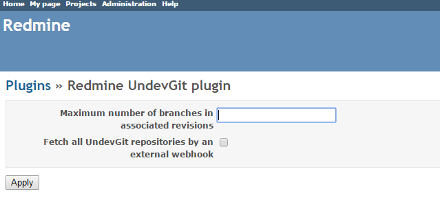
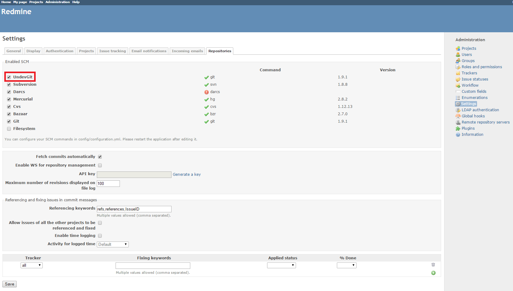
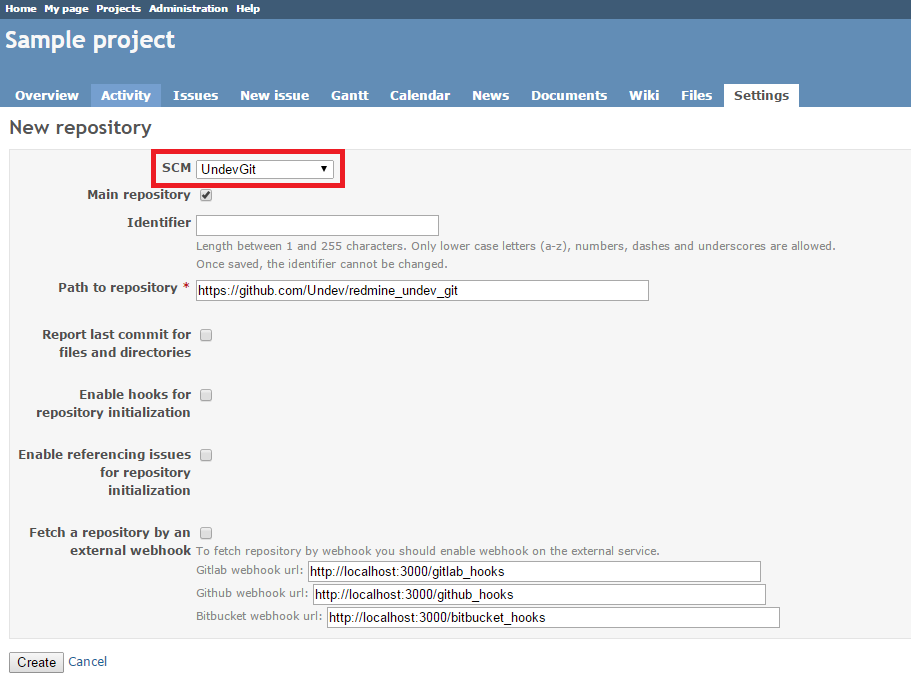
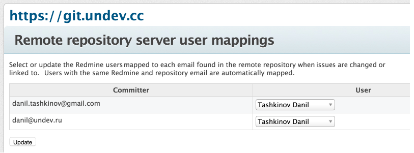
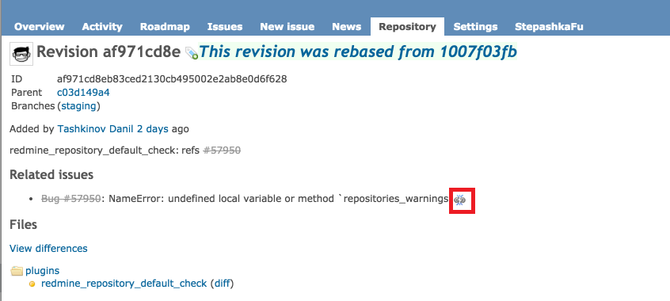
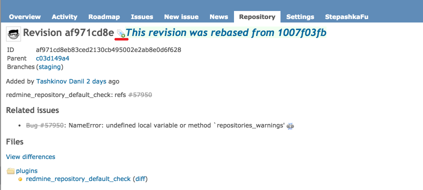
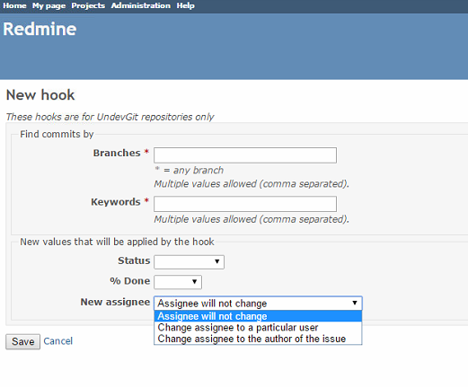
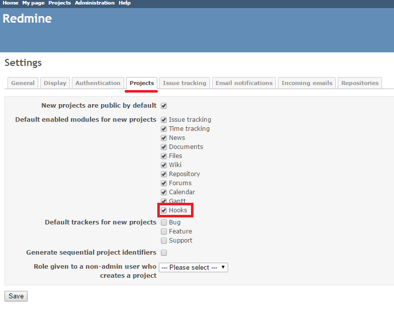
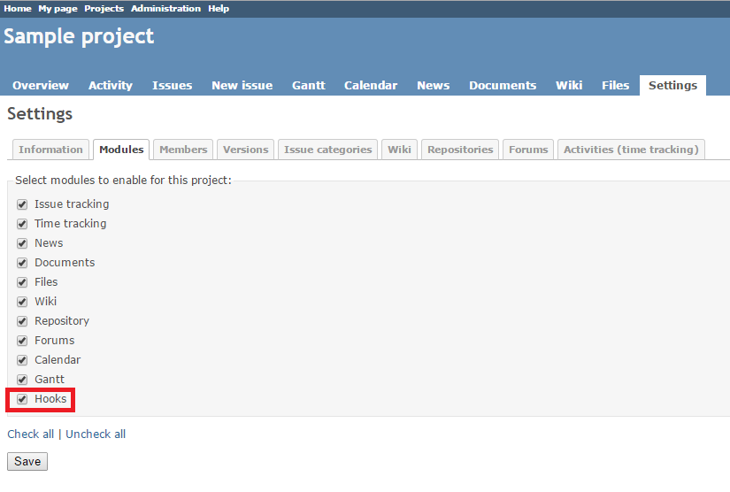
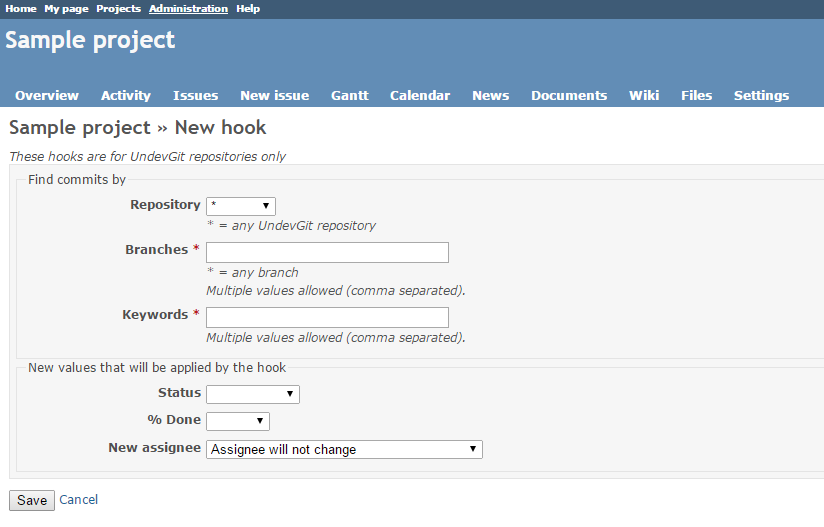

# Redmine UndevGit Plugin

The UndevGit plugin adds the UndevGit repository type to Redmine.

The UndevGit repository has all standard functions of a Git repository, as well as other features:

* possibility to work with remote repositories
* hooks for UndevGit repositories

When accessing a remote or local repository, UndevGit clones it and then works with the created copy.

## Compatibility

This plugin version is compatible only with Redmine 2.1.x and later.

## Installation

1. To install the plugin
    * Download the .ZIP archives, extract files and copy the plugin directory into #{REDMINE_ROOT}/plugin.
    
    Or

    * Change you current directory to your Redmine root directory:  

            cd {REDMINE_ROOT}
            
      Copy the plugin from GitHub using the following command:
      
            git clone https://github.com/Undev/redmine_undev_git.git plugins/redmine_undev_git
            
2. Install the required gems using the command:  

        bundle install  

    * In case of bundle install errors, remove the Gemfile.lock file, update the local package index and install the required dependencies. Then execute the `bundle install` command again:  

            rm Gemfile.lock
            sudo apt-get update
            sudo apt-get install -y libxml2-dev libxslt-dev libpq-dev
            bundle install
            
3. This plugin requires a migration. Run the following command to upgrade your database (make a database backup before):  

        bundle exec rake redmine:plugins:migrate RAILS_ENV=production

4. Restart Redmine.

Now you should be able to see the plugin in **Administration > Plugins**.

## Usage

### Configuring the plugin

To configure the plugin settings, go to **Administration > Plugins** and click **Configure**.  
  
The plugin allows you to specify the maximum number of branches to be displayed on 
the issue page in the **Associated revisions** section. An empty field or 0 means no restrictions.

For details on hook configuration, see the corresponding section below.

### Configuring the UndevGit repository

To enable the UndevGit repository type, go to **Administration > Settings**, switch to the **Repositories** tab, select the **UndevGit** check box in the **Enabled SCM** section and click **Save**.  

You can specify the directory for storing local repository copies by setting a value for the `scm_repo_storage_dir` key in the `config/configuration.yml` file. By default, the `repos` directory in the Redmine root directory is used, so local repository copies are stored in `repos\[projectidentifier]\[repository_id]`. When you remove a repository, the corresponding directory is deleted.

To add an UndevGit repository to a project, open the **Repositories** tab of the project **Settings**, click **New repository** and select the **UndevGit** value in the **SCM** drop-down list.  

You can delete a repository or change its settings by clicking the corresponding buttons on the **Repositories** tab.  

### Working with remote repositories

The plugin enables you to work with remote repositories without the need to add them to Redmine manually. 

To use this feature, you should configure a webhook for push events in your remote repository, for example, at [https://gitlab.com](https://gitlab.com]):  

A push that triggers the webhook will create a link to this repository in Redmine. To view the list of remote repositories, go to **Administration > Remote repository servers**.  

The hook can be run only by Redmine users with the corresponding permissions. The plugin determines the user's permissions based on mappings of the committers' emails with the Redmine users' emails. To view the mappings, click the **Users** link.  

If you want to fetch a remote repository again, click **Refetch repository**. In this case, the hooks that have been already executed will not be run again. If there is a new hook applicable to a previous commit (e.g., a hook has a new keyword or another branch name), this hook will be run.  

### Linking commits to issues

To link a commit to an issue, specify a keyword and the issue number starting with #, for example, `refs #123`. Keywords are set using the **Referencing keywords** field of the Redmine settings (**Administration > Settings > Repositories**).

If you set '*' as a keyword, specifying only the issue number with '#' will be enough to link a commit.

A commit linked to an issue is displayed in the **Associated revisions** section of the issue page.  

To unlink a commit from an issue, you should click the revision link and then click the **Delete relation** icon (available only for users with the appropriate permissions).

When working with a remote repository, you can use referencing keywords to link commits to issues in the same way as for repositories you have added manually. In this case, a commit linked to an issue will be displayed in the **Associated remote revisions** section of the issue page. To link a commit to an issue, a committer must have the appropriate permissions. To unlink a commit from an issue, you can click the **Delete relation** icon (available only for users with the appropriate permissions)  

Here the repository, branch or commit link takes you to an external server, while the link with the user name leads to the page of the corresponding Redmine user.

### Time logging

If a commit specifies the time spent by the user (for example, refs #10 @5h), this value will be added to the **Spent time** field of the issue description.

### Moving commits (rebase)

UndevGit enables you to determine which commits have be moved by using `git rebase`.

Old references to commits are not removed from the changeset list; instead, they are marked with a special icon linking to a new commit reference. Similarly, new commits are marked with icons linking to old commit references. 

The icon is available when viewing the list of commits or a specific commit.  

Using `rebase` does not cause any issue changes; however, the links in the **Associated revisions** section are updated. Using `rebase` does not affect time logs.

### Hooks configuration

Hooks are used to flexibly configure how and when an issue status should be changed.

You can configure global hooks that will be executed for all repositories, and project hooks that can be run for all project repositories, certain branches or a specific repository.

To add a global hook, go to **Administration > Global hooks** and click **New hook**.
Configure the hook as needed.  

To enable project hooks for all projects at once, go to **Administration > Settings**, switch to the **Projects** tab, select the **Hooks** check box and click **Save**.  

To enable project hooks for a specific project only, go to the project **Settings**, switch to the **Modules** tab, select the **Hooks** check box and click **Save**.  

To create a project hook, switch to the **Hooks** tab of the project settings. This tab also displays the global hooks you have already configured. To add a project hook, click **New hook**.  

You can select a repository or a branch to apply the hook and configure other settings as needed.  

If '*' is specified as a branch name (meaning any branch), the hook will be applied only once when a commit is added to the repository. If a branch name is explicitly stated, the hook will be applied only once when a commit is added to this branch.

Hooks change the issue statuses based on keywords; therefore, the keywords specified in the **Fixing keywords** field of the Redmine settings (**Administration > Settings > Repositories**) are not used. You should define a separate set of keywords for each hook.

### Hook priorities

Hook priorities are as follows:

* repository hooks (highest priority)
* project hooks
* global hooks (lowest priority)

If there are several hooks applicable to a commit, only the hook with the highest priority will be run. Hooks that are applied to all branches ('*') have a lower priority than hooks with branch names specified explicitly.

#### Examples

1. A commit is pushed to 2 branches (feature, develop) of one repository. There are 2 configured hooks: hook1 for branch '*', and hook2 for branch 'feature'. In this case, only hook2 will be run.

2. There are several hooks: global hook1 for branch '*'; global hook2 for branch 'master'; project hook3 for branches 'develop,staging'; repository hook4 for branch 'staging'; and repository hook5 for branch 'feature'.   
  When a user adds commit A to branch 'feature', hook5 is run.  
  When a user merges branch 'feature' to branch 'staging', hook4 is run.  
  When merging branch 'feature' to 'develop', hook3 is run.  
  When merging branch 'feature' to 'master', hook2 is run.  
  Hook1 is used only if commit B is pushed to branch 'featureX'.

## Testing

Unpack the test repositories:  

    rake test:scm:setup:undev_git

Create a database:  

    rake RAILS_ENV=test db:drop db:create db:migrate redmine:plugins:migrate

Launch tests for the redmine_undev_git plugin:  

    rake RAILS_ENV=test NAME=redmine_undev_git redmine:plugins:test

## Maintainers

Danil Tashkinov, [github.com/nodecarter](https://github.com/nodecarter)
    
## License

Copyright (c) 2015 Undev

Licensed under the Apache License, Version 2.0 (the "License");
you may not use this file except in compliance with the License.
You may obtain a copy of the License at

http://www.apache.org/licenses/LICENSE-2.0

Unless required by applicable law or agreed to in writing, software
distributed under the License is distributed on an "AS IS" BASIS,
WITHOUT WARRANTIES OR CONDITIONS OF ANY KIND, either express or implied.
See the License for the specific language governing permissions and
limitations under the License.
